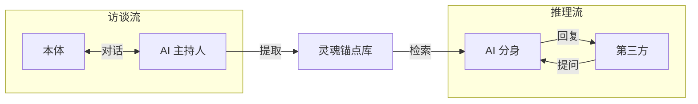
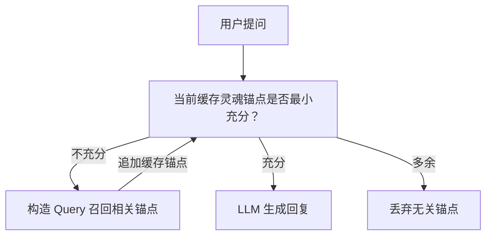
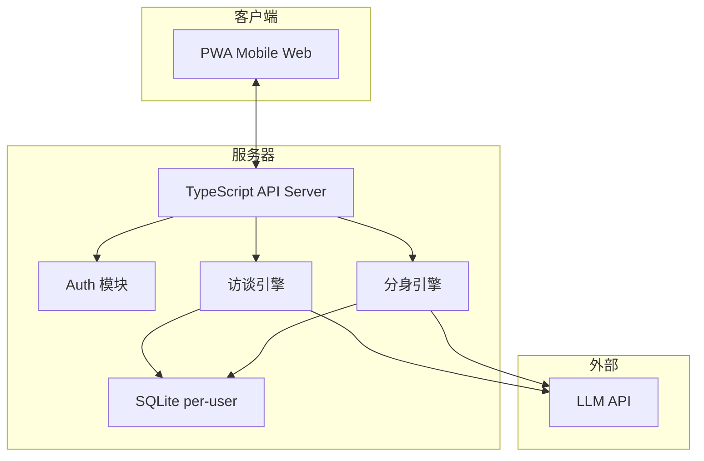

# ReMi 鉴心

ReMi = **Re**flect your **Mi**nd；鉴心 = 反思你的内心。鉴是审视、鉴别的意思，心是内心、认知的意思。这个名字的寓意是：通过反思和审视，让 AI 分身更好地理解和表达你的内心世界。

## 产品定位

一句话：**AI 个人分身**。让每个人都能拥有一个理解自己认知方式的 AI 分身，第三方可以直接跟你的分身对话，得到"像你会说的话"。从而，你的分身能代替你在所有工作流中做出符合你认知的决策和行动。

核心不是聊天机器人，是**认知对齐**。分身的质量取决于我们对本体隐含知识的挖掘深度。

## 核心概念

先把几个概念理清楚，后面的设计全部基于这套语言。

**灵魂（Soul）**：灵魂是环境到反馈的映射函数。灵魂能够在相同的环境下做出一致性的反馈。如果两个灵魂在相同环境下，能够做出相同的反馈，那么，这两个灵魂就是相同的。本体和分身的灵魂对齐，视为产品成功的标志。

**灵魂锚点（Soul Anchor）**：锚定灵魂本质的核心问题与答案。每个锚点包含一个**问题**和对应的**答案**（答案可以为空）。通过预设问题和自动发现的矛盾，持续塑造和完善灵魂的认知框架。

**记忆（Memory）**：一切可以被记录的内容片段。陈述句形式，锚定在时间轴上。记忆是灵魂的基石，承载经验、知识和情感。

这套概念的关键洞察：**锚点是问答对，不是散装认知片段**。有问题才有锚定，答案为空意味着"还没探索到"，而不是"不存在"。访谈的本质就是在填充这些锚点的答案。

## MVP: 访谈 + 推理

MVP 阶段只做两件事：

1. **访谈流**：AI 主持人对本体做结构化访谈，产出灵魂锚点（Soul Anchors）
2. **推理流**：第三方向分身提问，分身检索灵魂锚点生成回复

这两个流共享同一个灵魂锚点库，但运行逻辑完全不同。访谈流是知识采集，推理流是知识应用。

## 访谈阶段

之前写过一篇 [文章](https://readme.zccz14.com/zh-Hans/ai-host-interview-cognitive-alignment-engine.html) 讨论访谈作为认知对齐引擎的设计。核心判断不变：**访谈信息质量 = 控制感 × 价值感 × 相关感**。任何一个接近零，整场就塌。

AI 主持人的最小可行协议分五层：

1. **目标层**：始终优化"问题对齐 + 隐含知识显化"
2. **策略层**：严格执行"先轻量 → 再求新 → 最后具体"的三步提问协议
3. **状态层**：识别受访者状态（愿意聊 / 防御 / 疲劳 / 跑题），切换提问模式
4. **记忆层**：实时 RTFM 去重，不问已经知道的东西，区分高价值认知与噪声
5. **审计层**：所有引用可追溯，所有追问有链路

坏问题的优先级：太重 > 太旧 > 太空。对应的防御策略就是三步协议——先让对方说得出来，再证明这次对话值得，最后用证据锚点做具体追问。

冷启动时不装懂，先声明边界，给选择权，用时间锚点降低启动门槛。对方不想聊就从开放题切到选择题。

实现上，访谈是一个多轮对话循环。每轮 AI 主持人根据当前灵魂锚点库的覆盖情况和对话历史，决定下一个问题。关键是要做到**实时去重**——已经采集过的认知不重复追问。

## 推理阶段

第三方向分身提问时，核心环节不是生成，是**召回**。生成只要锚点给对了，LLM 都能说像；但锚点没召回来，说什么都是编的。

所以推理流的核心是一个 **Agentic Recall** 循环：

每一轮循环：LLM 审视当前已召回的锚点，判断是否足以回答用户的问题。"充分"不只是话题相关——分身需要知道自己是谁、对方是谁、该用什么口吻说话，这些都是锚点，都要被召回。如果不够，改写 query、换角度检索、补充遗漏维度，直到充分才生成。

注意这里没有单独的"本体人格描述"注入步骤。概念上，Profile 就是那些高频被召回的锚点——"我是谁"、"我的口吻是什么"、"我的核心价值观"这些问题的答案。如果我们不预先假设什么是 Profile，而是让系统自己从高频 recall 中发现哪些锚点是 Profile，反而更有意思。缓存高频锚点是性能优化，不是概念必须。

这里有一个第一性原理的推导：**理论最优解是把所有锚点全部拉出来，逐一判断和提问的相关性，多轮迭代构造完整推理链路**。这一定能给出最正确的结果，但成本不可接受。所以我们要做的是启发式地逼近这个效果——用 Agentic 循环代替穷举，用 query 优化代替全量扫描。

目前阶段，成本不是最关键的，效果才是。宁可多跑几轮召回，也不能让分身说出本体不会说的话。

## 技术架构

技术选型的核心考量：Demo 要能在路演现场用，观众扫码直接体验。

- **前端**：PWA，mobile-first，支持文字/语音/图片输入。不做原生 App，扫码即用，零安装摩擦
- **后端**：TypeScript 全栈，我最熟的语言，约束最强
- **LLM**：OpenAI-compatible API 格式，方便切换模型
- **存储**：SQLite per-user，一人一个数据库文件。数据隔离天然，备份简单，迁移方便
- **部署**：单机集中式服务器

为什么选 SQLite per-user 而不是 PostgreSQL？三个理由：一是数据隔离天然，不需要在查询层面做租户过滤；二是用户数据可以整文件备份、导出、迁移；三是 Demo 阶段不需要复杂查询，SQLite 足够。等用户量真正起来再考虑迁移。
