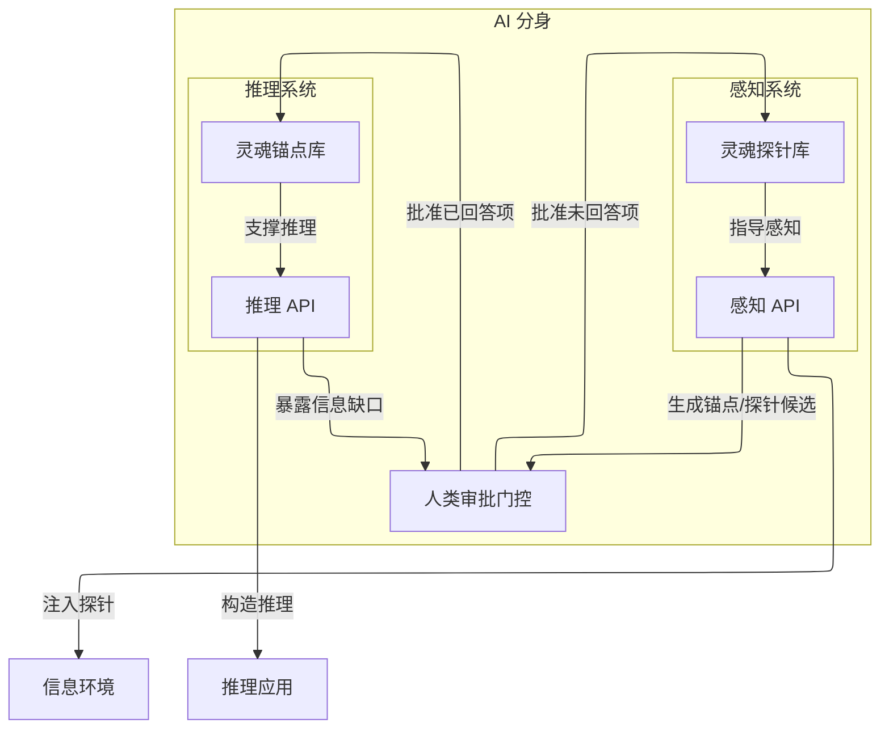
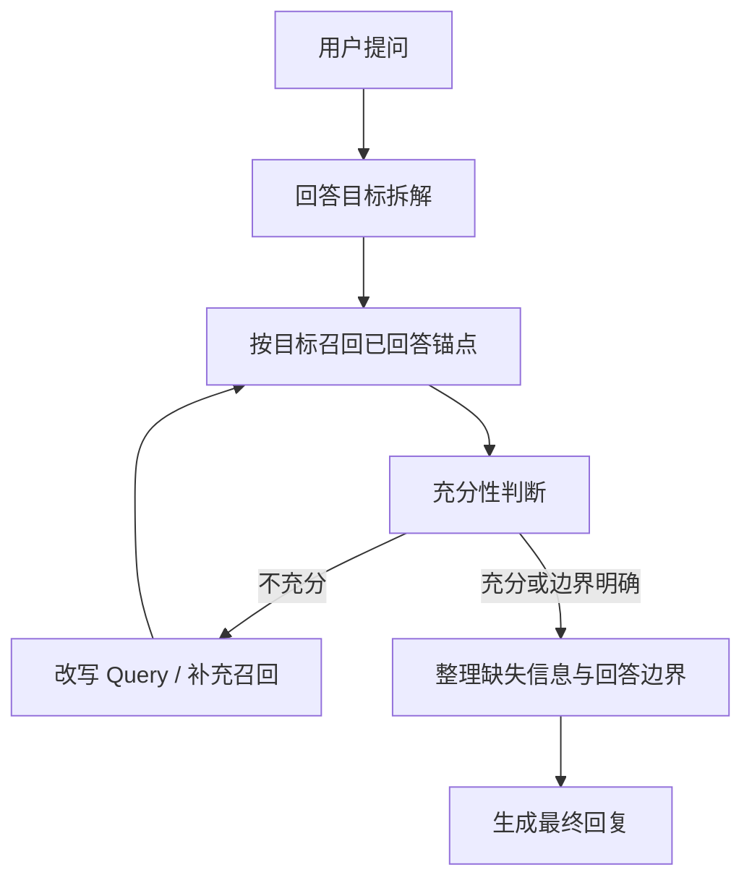
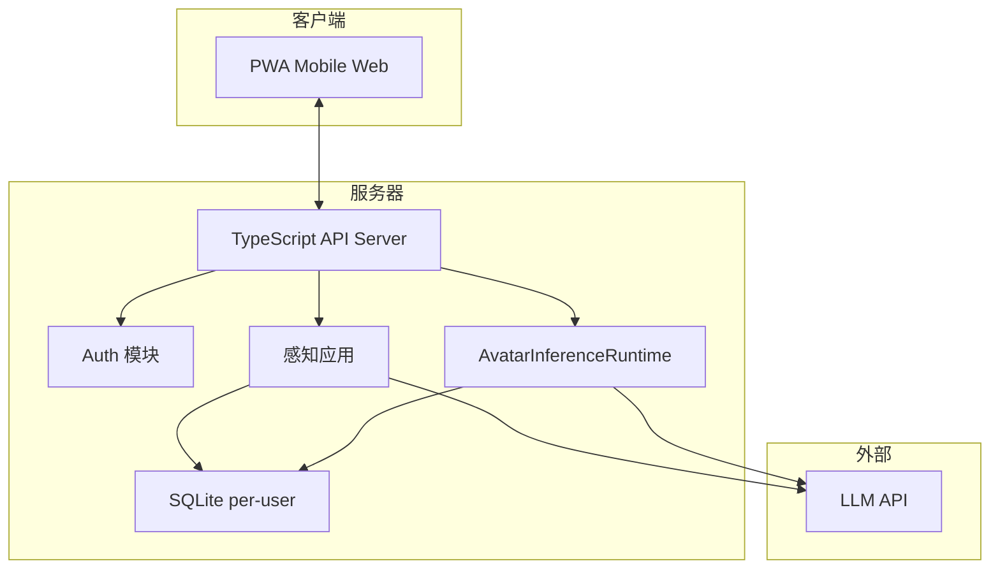

# ReMi 鉴心

ReMi = **Re**flect your **Mi**nd；鉴心 = 反思你的内心。鉴是审视、鉴别的意思，心是内心、认知的意思。这个名字的寓意是：通过反思和审视，让 AI 分身更好地理解和表达你的内心世界。

## 产品定位

一句话：**AI 个人分身**。让每个人都能拥有一个理解自己认知方式的 AI 分身，第三方可以直接跟你的分身对话，得到"像你会说的话"。从而，你的分身能代替你在所有工作流中做出符合你认知的决策和行动。

核心不是聊天机器人，是**认知对齐**。分身的质量取决于我们对本体隐含知识的挖掘深度。

## 核心概念

先把几个概念理清楚，后面的设计全部基于这套语言。

**灵魂（Soul）**：灵魂是环境到反馈的映射函数。灵魂能够在相同的环境下做出一致性的反馈。如果两个灵魂在相同环境下，能够做出相同的反馈，那么，这两个灵魂就是相同的。本体和分身的灵魂对齐，视为产品成功的标志。

**灵魂锚点（Soul Anchor）**：围绕某个问题组织的认知单位。锚点至少包含一个**问题**，也可以包含对应的**答案**。它的工程意义是：把未来可能被反复问到的问题预先回答一部分，作为推理时可复用的认知缓存。

**已回答锚点**：已经形成稳定答案的锚点。它们是推理时可直接使用的认知证据。

**灵魂探针（Soul Probe）**：未回答的锚点，即锚点的未完成态。探针表示我们已经知道“这个问题值得问”，但还没有得到足够稳定的答案。探针的作用不是直接回答问题，而是指导后续感知去观察什么、补问什么、固化什么。

这套概念的关键洞察：**锚点的本质是问答结构，也是推理缓存；探针的本质是感知索引**。有问题才有锚定；答案为空不是“不存在”，而是“还没探索到”。访谈、阅读等应用的本质，都是带着探针进入环境，持续发现问题、补全答案、提升锚点质量。

## AI 分身的边界

MVP 只证明一条最短价值链：**高质量锚定 -> 像本体回答**。

1. **感知**：带着灵魂探针进入环境，从环境中生成高质量的锚点候选与探针候选，并通过人类审批门控落库。访谈和阅读都是正式入口，但它们只是不同的应用场景，不是不同的底层认知概念。当前阶段的重点不是“采得越多越好”，而是“高价值、低冗余、审批负担可控”。
2. **推理**：分身提供 OpenAI 兼容的推理 API。推理阶段的核心不是单纯生成，而是围绕回答目标做锚点召回、充分性判断与边界控制，再生成最终回复。最优先的目标是输出质量，其次才是成本和效率。



## ReMi 的记忆哲学观

> 已有的事后必再有；已行的事后必再行。日光之下并无新事。——《传道书》 1:9

**在 ReMi 系统建模中，记忆（Memory）并不是一等认知对象。** 所谓记忆，归根结底只是曾经你有限的注意力所感知到的世界的一角。你的记忆并非这个世界的全部，甚至人类集体的记忆也只是世界记忆中微不足道的尘埃。这个世界上仍然有无数人类没有注意到的细节和维度。与其守着尘埃，不如带着探针去感知更广阔的世界。

**记忆是过往的，也是未来的。** 对于任何过往的记忆，原则上都应该可以**在未来对信息环境的探索行动中**被再次发现或验证。否则，它就无法成为可靠的认知依据。例如，你在 10 年前对朋友说过“我今天吃了牛肉”，如果聊天记录丢失了，当事人也忘记了，连相关的消费记录也没有留存，那么这段记忆对于系统而言就几乎不可验证。相反，如果这件事在任何地方被留痕了，那么它就可以在未来被再次探索发现。记忆的本质，不只在于它曾经发生过，更在于它未来能否被再次发现、验证。AI 的意义之一，就是把这种“重新探索与验证”的执行成本降到更低。

**推理质量的第一性原理**：理论最优解是：带着当前问题，重新访问本体全部历史，再完整阅读理解一遍。如果这个流程仍然无法产出足够的**盖然性 (plausibility)**，那么推理就是无法成立的。ReMi 追求的不是脱离证据的“绝对真”，而是在当前证据约束下，给出足够高盖然性的判断，并显式暴露低盖然性的部分。而 AI 广为诟病的“幻觉”，其本质就是：在盖然性过低时，仍然输出了过高确定性的表达。

我们认为，与其试图完美回收和管理全部过去的记忆，不如带着探针去感知当下与未来；因为我们会在未来不断再次遇到过去的自己。感知的意义，就是加速这些值得被锚定的问题再次出现，并把它们固化为锚点建议。将探针插入环境，让 AI 自己在探索环境的过程中发现和验证那些问题的答案。

**记忆的载体只是环境的一部分**。传统 AI 记忆系统的方案通常是：先把全部记忆建索引，然后根据问题去检索相关记忆，再按图索骥地推理。然而，这在第一步压缩剪枝时就已经开始失真了。记忆本身也不应该暗示它是最终结论。尽管我可能说过"我最喜欢吃苹果"，但这并不意味着我永远喜欢吃苹果。这个记忆可能是错误的、过时的、片面的。它只是一个时间点上的快照，而不是一个稳定锚点。如果召回时只抽到其中一段记忆，它就会误导推理。记忆只有在完整上下文中才更容易被正确理解和使用，换言之，记忆被断章取义的风险非常大。

记忆的价值是，如果事后能被慢慢验证和转化成锚点，那么它就有了价值。数据库、博客、日记、文件夹，都是记忆的载体。但 ReMi 在 MVP 中不把 memory 作为分身内部的一等认知对象来管理，而是把它视为环境语料的一部分。更重要的是，过去本来也并没有被完整记录，很多细节已经不可考。带着问题，重读一遍，才是使用记忆载体最好的做法。任何对原始记忆的压缩都是有代价的。而这个问题如果值得反复问、高频问，它就应该变成一个锚点。

## 应用场景文档

README 只描述统一产品概念与 MVP 边界。不同用户场景的详细协议，拆分到独立文档中维护：

- `docs/apps/interview.md`：通过多轮对话持续显化本体认知的应用场景
- `docs/apps/reading.md`：通过外部材料批量发现和校正本体认知的应用场景
- `docs/roadmap.md`：主动调度、执行层、预算系统等非 MVP 方向

## 推理阶段

第三方向分身提问时，核心环节不是单纯生成，而是**围绕回答目标组织推理**。从第一性原理看，理论最优解永远是：带着当前问题，重新访问本体全部历史原文，再完整扫描一遍。但这个成本工程上不可接受，所以推理系统必须依赖灵魂锚点这层缓存。生成只是在最后一步把已经召回并判断过充分性的认知表达出来；如果锚点没召回来、边界没判断清楚，说什么都可能是编的。ReMi 的目标不是在任何问题上都给出绝对判断，而是在当前证据下，尽量把回答推进到更高盖然性；当盖然性仍然不足时，就应该转为保守表达、承认边界，或者继续生成新的探针。

当前实现里，推理主链已经统一收敛到 `AvatarInferenceRuntime`。它的核心流程不是一个孤立的 recall loop，而是：

1. 先对用户问题做 **回答目标拆解（decomposition）**
2. 围绕这些目标做 **锚点召回（goal-based recall）**
3. 判断当前召回是否 **最小充分（sufficiency judgment）**
4. 显式整理 **缺失信息与回答边界**
5. 最后才进入 **回答生成**

它仍然保留了一个以召回和充分性判断为中心的循环：



每一轮循环：LLM 审视当前已召回的锚点，判断它们是否足以支撑回答目标。"充分"不只是话题相关——分身需要知道自己是谁、对方是谁、该用什么口吻说话、哪些事实已经有证据、哪些部分仍然缺信息，这些都要被判断清楚。这里判断的不是抽象上的真假，而是当前证据是否已经把回答推进到足够高的盖然性。如果不够，就改写 query、换角度检索、补充遗漏维度；直到足够、或者明确承认边界。

注意这里没有单独的“本体人格描述”大礼包注入步骤。概念上，Profile 就是那些高频被召回的已回答锚点——“我是谁”、“我的口吻是什么”、“我的核心价值观”这些问题的答案。如果系统能从高频 recall 中自己发现哪些锚点构成 Profile，就比预先手写一段人格设定更接近真正的认知对齐。缓存高频锚点是性能优化，不是概念必须。

这里有一个第一性原理的推导：**理论最优解是带着当前问题，重新访问本体全部历史原文，再逐一判断和问题的相关性，构造完整推理链路**。这一定能给出最充分的结果，但成本不可接受。所以我们才需要锚点缓存：用“预先回答一批未来高频问题”的方式，把一部分原本需要临场重扫的认知提前固化下来。工程上的目标，不是直接替代原文，而是用召回与充分性判断循环去逼近“重扫原文”的效果。

目前阶段，成本不是最关键的，效果才是。宁可多跑几轮召回与充分性判断，也不能让分身说出本体不会说的话。

## 技术架构

技术选型的核心考量：Demo 要能在路演现场用，观众扫码直接体验。

- **前端**：PWA，mobile-first，支持文字/语音/图片输入。不做原生 App，扫码即用，零安装摩擦
- **后端**：TypeScript 全栈，我最熟的语言，约束最强
- **LLM**：OpenAI-compatible API 格式，方便切换模型
- **存储**：SQLite per-user，一人一个数据库文件。数据隔离天然，备份简单，迁移方便
- **部署**：单机集中式服务器



为什么选 SQLite per-user 而不是 PostgreSQL？三个理由：一是数据隔离天然，不需要在查询层面做租户过滤；二是用户数据可以整文件备份、导出、迁移；三是 Demo 阶段不需要复杂查询，SQLite 足够。等用户量真正起来再考虑迁移。

## 本地开发

日常本地开发直接运行：

```bash
npm run dev
```

这会同时启动：

- 后端 Hono 服务
- 前端 Vite 开发服务器

当前开发体验约定：

- 修改后端 TypeScript 源码后，后端会自动重启生效
- 这是一种基于进程重启的 watch 行为，不是 HMR，也不会保留服务端内存状态
- 前端仍然使用 Vite 自己的开发体验与热更新机制

## 本地分享试玩

如果你想先把本地开发中的 ReMi 分享给别人试玩，当前推荐走 `cloudflared` 临时隧道方案。

### 启动方式

```bash
npm run dev:public
```

这会启动：

- Hono 入口：`http://localhost:8787`
- Vite 开发服务器：`http://localhost:5173`

其中只有 `8787` 应该被暴露给外部。Vite 只绑定在 `localhost`，不要直接拿 `5173` 做 tunnel。

### 启动 cloudflared

```bash
cloudflared tunnel --url http://localhost:8787
```

`cloudflared` 会返回一个临时的 `*.trycloudflare.com` 地址。把这个地址发给别人即可。

### 验证清单

1. 运行 `npm run dev:public`
2. 打开 `http://localhost:8787`，确认页面能正常加载
3. 确认浏览器里的 API 请求都走当前域名，而不是固定打到 `localhost:3000`
4. 运行 `cloudflared tunnel --url http://localhost:8787`
5. 用另一个浏览器或另一台设备打开生成的 `trycloudflare.com` 地址
6. 确认前端路由跳转和刷新可用
7. 确认聊天等核心 API 流程正常
8. 确认没有额外的内部调试路由被这个公共入口暴露出去

### 注意事项

- 这是 Phase 1 的临时试玩方案，不是正式生产部署
- 你的 Mac 需要保持在线且不休眠，否则外部访问会中断
- 远端访客的 HMR 不是目标能力；如果热更新链路不稳定，手动刷新页面是可接受退化
