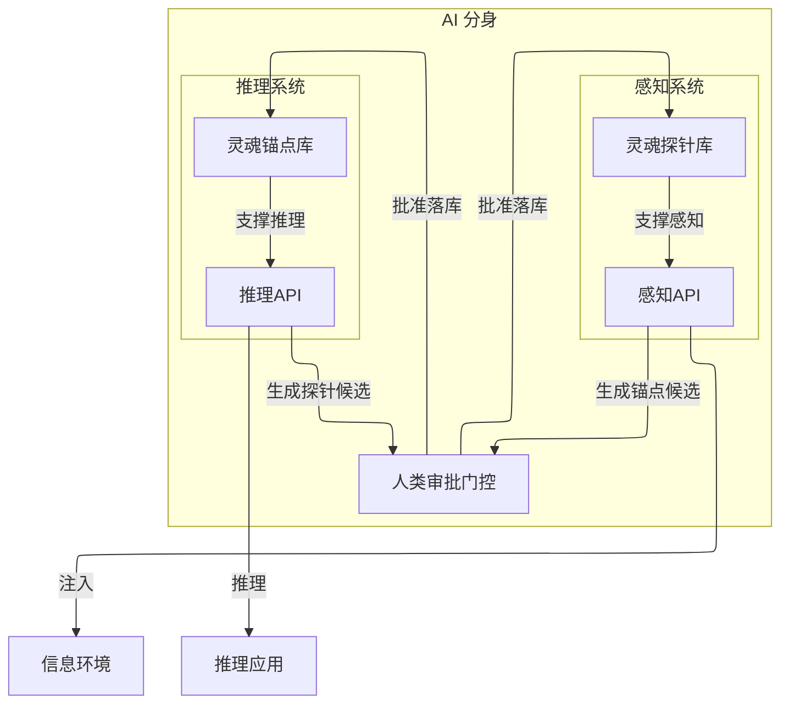
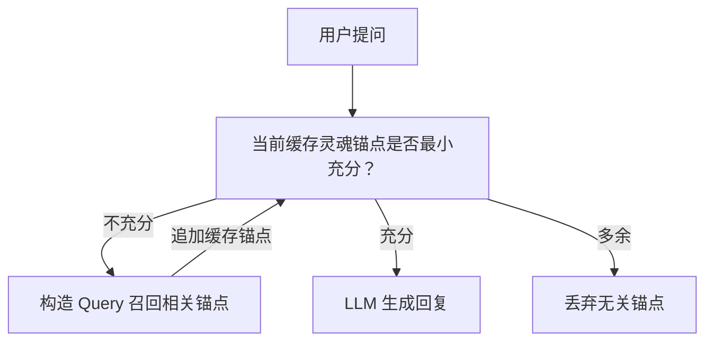
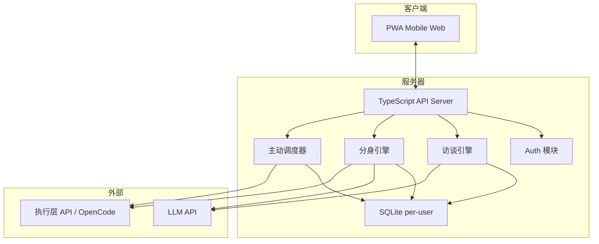

# ReMi 鉴心

ReMi = **Re**flect your **Mi**nd；鉴心 = 反思你的内心。鉴是审视、鉴别的意思，心是内心、认知的意思。这个名字的寓意是：通过反思和审视，让 AI 分身更好地理解和表达你的内心世界。

## 产品定位

一句话：**AI 个人分身**。让每个人都能拥有一个理解自己认知方式的 AI 分身，第三方可以直接跟你的分身对话，得到"像你会说的话"。从而，你的分身能代替你在所有工作流中做出符合你认知的决策和行动。

核心不是聊天机器人，是**认知对齐**。分身的质量取决于我们对本体隐含知识的挖掘深度。

## 核心概念

先把几个概念理清楚，后面的设计全部基于这套语言。

**灵魂（Soul）**：灵魂是环境到反馈的映射函数。灵魂能够在相同的环境下做出一致性的反馈。如果两个灵魂在相同环境下，能够做出相同的反馈，那么，这两个灵魂就是相同的。本体和分身的灵魂对齐，视为产品成功的标志。

**灵魂锚点（Soul Anchor）**：锚定灵魂本质的核心问题与答案。每个锚点包含一个**问题**和对应的**答案**（答案可以为空）。通过预设问题和自动发现的矛盾，持续塑造和完善灵魂的认知框架。

**灵魂探针 (Soul Probe)**：一个未回答的灵魂问题。它是一个有待探索的认知领域，是一个潜在的认知盲点。探针的存在表明我们对某个问题还没有足够的理解，或者我们对某个问题的理解存在矛盾。通过不断地提出和回答探针，我们可以逐步完善我们的认知体系，达到更高水平的自我理解。灵魂探针可以被视为一个认知的"待办事项"，它提醒我们还有哪些问题需要去探索和解答。它可以在执行环境中被自动回答。

这套概念的关键洞察：**锚点是问答对，不是散装认知片段**。有问题才有锚定，答案为空意味着"还没探索到"，而不是"不存在"，也意味着是一个有待回答的问题，即灵魂探针。访谈的本质就是在填充这些锚点的答案。

## MVP: 构建 AI 分身的边界

1. **推理**：分身提供 OpenAI 兼容的推理 API，分身检索灵魂锚点生成回复，每个分身都是一个微调后的专属 LLM 模型。这个过程中，如何进行锚点召回、如何构造 prompt、如何判断生成结果的质量，是核心挑战。最优先的目标是优化输出质量，其次是成本和效率。
2. **感知**：解决如何从环境中生成高质量的锚点候选，并通过人类审批门控落库的问题。这里的核心挑战是设计一个高效的锚点生成流程，以及一个合理的人类审批机制，确保落库的锚点既有价值又不过于冗余，人类的审批工作量可控。



## 关于记忆和灵魂锚点的关系

**为什么我认为系统建模中，没有记忆 (Memory) 这个概念？**

关于记忆的考虑：我认为灵魂锚点是长期稳定的认知，是真正值得记忆的长期记忆。毫无疑问，我们没必要记住所有发生过的事情，只需要记住对推理有帮助的内容。记忆是有代价的，遗忘是必要的生存优势，即便是对于 AI 分身也是一样的。记忆是一个无问题的陈述句，是一个流水账，它不是一个灵魂锚点。你很难对一个记忆进行强行赋予一个问答的形式，这是没有意义的。

那么记忆有什么代价？首先是它并不应该暗示它是最终结论。尽管我可能说过"我最喜欢吃苹果"，但这并不意味着我永远喜欢吃苹果。这个记忆可能是错误的，或者是过时的，或者是片面的。它只是一个时间点上的快照，而不是一个稳定的锚点。也许我后面又说过"我最喜欢吃火锅"，那么这个新的记忆又和之前的记忆产生了冲突，实际上它们的类别并不相同，一个是水果一个是菜式。但是，如果在召回中我只召回其中一个记忆，那么这个记忆就会误导推理。记忆仅有在完整的上下文中才能被正确理解和使用，换言之，记忆被断章取义的风险非常大。

记忆的价值是，如果事后能被慢慢验证和转化成锚点，那么它就有了价值。而我认为，实际上记忆早已经可以被储存了，数据库，博客，日记，文件夹，都是记忆的载体。我认为并不存在特别高效的所谓记忆的存储/检索方案。因为高效的检索必然伴随着更高的片面性和误导风险。还不如让记忆保持原汁原味，完整地保存在一个地方，等到需要的时候再去检索和理解它。记忆的价值在于它的潜在信息量，而不是它的即时可用性。我们不应该过度优化记忆的检索效率，而是应该关注如何从记忆中提炼出有价值的锚点。而这件事，我认为记忆是环境的一部分，而不是分身内部的一部分。分身可以通过感知记忆来生成锚点，但不应该直接把记忆当作分身的内部状态来管理。

Re-read the original memory with a specified question. 带着问题，重读一遍，才是使用记忆最好的做法。任何对原始记忆的压缩都是有代价的。而这个问题如果值得反复问，高频问，它就应该变成一个锚点。灵魂锚点是对某个问题的稳定回答，而记忆是对某个时间点的记录。前者是认知的核心，后者是认知的原材料。我们要做的，是从记忆中提炼出有价值的锚点，而不是把所有记忆都当作锚点来管理。当然锚点也是一种记忆压缩手段，但它至少是解决特定问题的。

## 主动调度阶段

ReMi 不应该只是一个被动应答的分身。除了在访谈中理解本体、在推理中代表本体回答问题，分身还应该能够围绕目标持续主动推进工作。

这里的核心不是"自动执行一串脚本"，而是**目标管理 + 主动调度**：

- 用户为分身设定一个长期目标，目标采用树形结构组织
- 分身被唤起时，从根目标开始，贪心地选择当前最有价值的一条路径向下访问
- 每次激活都可以局部维护目标树，例如创建新任务、关闭失效节点、重排子节点优先级
- 可执行叶子节点对应外部执行层中的一个 Session，分身通过继续推进这个 Session 来推动目标前进

### 执行层边界

ReMi 本身不直接承担所有执行细节。MVP 中会存在一个独立的执行层进程，对外暴露 Base URL / API：

- ReMi 通过执行层 API 查询 Session 状态
- 可执行任务的实际载体是 OpenCode Session
- 分身推进任务时，会读取 Session history，并向 Session 追加新的 prompt input
- 如果当前路径下没有合适的 Session，分身可以自主创建新的 Session，并立即启动第一轮推进

这让 ReMi 保持"调度中枢"的角色：负责决定下一步做什么、为什么做；执行层负责把动作真正跑起来。

### 进度不是分身自评

主动调度里一个非常重要的约束是：**进度不能由分身自己主观打分**。

分身可以定义评价标准、注入测试思路、要求执行层按某种流程验证，但真正的进度更新必须来自可验证的执行结果。例如：

- 执行层运行测试并返回 `pass / fail`
- 100 个测试通过 90 个，则该任务进度视为 90%
- ReMi 根据结构化结果更新任务节点和父目标的聚合进度

换句话说，分身决定"接下来要推进什么"，执行结果决定"到底推进了多少"。

### 思考预算与双层调度

主动调度不是无限免费算力，而是受预算约束的持续循环：

- **用户预算**：用户可购买自己的思考预算（Token Per Minute），在预算内持续推进目标
- **平台预算**：平台提供免费预算，通过公平轮转的方式在所有用户之间分配主动推进机会

两套预算是并行的，不互相替代：

- 平台预算负责让所有分身都能被低频但持续地推进
- 用户预算负责给自己的分身额外加速
- 无论哪种预算触发，单次激活都遵循同一个主动调度协议

这个调度协议更接近 Ralph-Loop：目标不会因为一轮执行结束就停止，而是会在预算允许的前提下持续被唤起、持续被推进，直到目标被明确 disabled。

## 访谈阶段

之前写过一篇 [文章](https://readme.zccz14.com/zh-Hans/ai-host-interview-cognitive-alignment-engine.html) 讨论访谈作为认知对齐引擎的设计。核心判断不变：**访谈信息质量 = 控制感 × 价值感 × 相关感**。任何一个接近零，整场就塌。

AI 主持人的最小可行协议分五层：

1. **目标层**：始终优化"问题对齐 + 隐含知识显化"
2. **策略层**：严格执行"先轻量 → 再求新 → 最后具体"的三步提问协议
3. **状态层**：识别受访者状态（愿意聊 / 防御 / 疲劳 / 跑题），切换提问模式
4. **记忆层**：实时 RTFM 去重，不问已经知道的东西，区分高价值认知与噪声
5. **审计层**：所有引用可追溯，所有追问有链路

坏问题的优先级：太重 > 太旧 > 太空。对应的防御策略就是三步协议——先让对方说得出来，再证明这次对话值得，最后用证据锚点做具体追问。

冷启动时不装懂，先声明边界，给选择权，用时间锚点降低启动门槛。对方不想聊就从开放题切到选择题。

实现上，访谈是一个多轮对话循环。每轮 AI 主持人根据当前灵魂锚点库的覆盖情况和对话历史，决定下一个问题。关键是要做到**实时去重**——已经采集过的认知不重复追问。

## 推理阶段

第三方向分身提问时，核心环节不是生成，是**召回**。生成只要锚点给对了，LLM 都能说像；但锚点没召回来，说什么都是编的。

所以推理流的核心是一个 **Agentic Recall** 循环：



每一轮循环：LLM 审视当前已召回的锚点，判断是否足以回答用户的问题。"充分"不只是话题相关——分身需要知道自己是谁、对方是谁、该用什么口吻说话，这些都是锚点，都要被召回。如果不够，改写 query、换角度检索、补充遗漏维度，直到充分才生成。

注意这里没有单独的"本体人格描述"注入步骤。概念上，Profile 就是那些高频被召回的锚点——"我是谁"、"我的口吻是什么"、"我的核心价值观"这些问题的答案。如果我们不预先假设什么是 Profile，而是让系统自己从高频 recall 中发现哪些锚点是 Profile，反而更有意思。缓存高频锚点是性能优化，不是概念必须。

这里有一个第一性原理的推导：**理论最优解是把所有锚点全部拉出来，逐一判断和提问的相关性，多轮迭代构造完整推理链路**。这一定能给出最正确的结果，但成本不可接受。所以我们要做的是启发式地逼近这个效果——用 Agentic 循环代替穷举，用 query 优化代替全量扫描。

目前阶段，成本不是最关键的，效果才是。宁可多跑几轮召回，也不能让分身说出本体不会说的话。

## 技术架构

技术选型的核心考量：Demo 要能在路演现场用，观众扫码直接体验。

- **前端**：PWA，mobile-first，支持文字/语音/图片输入。不做原生 App，扫码即用，零安装摩擦
- **后端**：TypeScript 全栈，我最熟的语言，约束最强
- **LLM**：OpenAI-compatible API 格式，方便切换模型
- **存储**：SQLite per-user，一人一个数据库文件。数据隔离天然，备份简单，迁移方便
- **部署**：单机集中式服务器



为什么选 SQLite per-user 而不是 PostgreSQL？三个理由：一是数据隔离天然，不需要在查询层面做租户过滤；二是用户数据可以整文件备份、导出、迁移；三是 Demo 阶段不需要复杂查询，SQLite 足够。等用户量真正起来再考虑迁移。

## 本地开发

日常本地开发直接运行：

```bash
npm run dev
```

这会同时启动：

- 后端 Hono 服务
- 前端 Vite 开发服务器

当前开发体验约定：

- 修改后端 TypeScript 源码后，后端会自动重启生效
- 这是一种基于进程重启的 watch 行为，不是 HMR，也不会保留服务端内存状态
- 前端仍然使用 Vite 自己的开发体验与热更新机制

## 本地分享试玩

如果你想先把本地开发中的 ReMi 分享给别人试玩，当前推荐走 `cloudflared` 临时隧道方案。

### 启动方式

```bash
npm run dev:public
```

这会启动：

- Hono 入口：`http://localhost:8787`
- Vite 开发服务器：`http://localhost:5173`

其中只有 `8787` 应该被暴露给外部。Vite 只绑定在 `localhost`，不要直接拿 `5173` 做 tunnel。

### 启动 cloudflared

```bash
cloudflared tunnel --url http://localhost:8787
```

`cloudflared` 会返回一个临时的 `*.trycloudflare.com` 地址。把这个地址发给别人即可。

### 验证清单

1. 运行 `npm run dev:public`
2. 打开 `http://localhost:8787`，确认页面能正常加载
3. 确认浏览器里的 API 请求都走当前域名，而不是固定打到 `localhost:3000`
4. 运行 `cloudflared tunnel --url http://localhost:8787`
5. 用另一个浏览器或另一台设备打开生成的 `trycloudflare.com` 地址
6. 确认前端路由跳转和刷新可用
7. 确认聊天等核心 API 流程正常
8. 确认没有额外的内部调试路由被这个公共入口暴露出去

### 注意事项

- 这是 Phase 1 的临时试玩方案，不是正式生产部署
- 你的 Mac 需要保持在线且不休眠，否则外部访问会中断
- 远端访客的 HMR 不是目标能力；如果热更新链路不稳定，手动刷新页面是可接受退化
